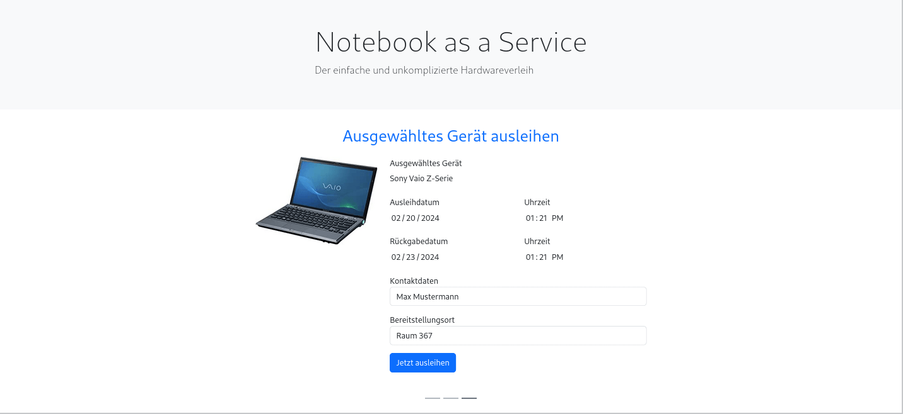
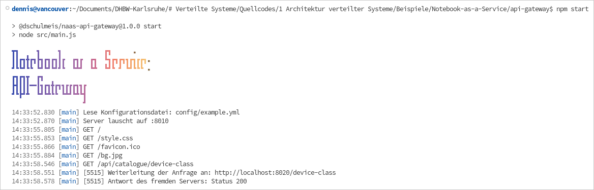
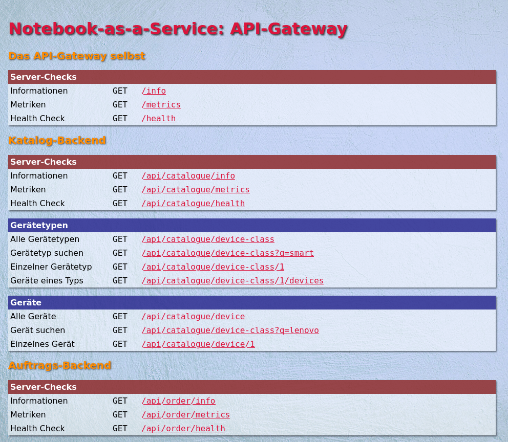
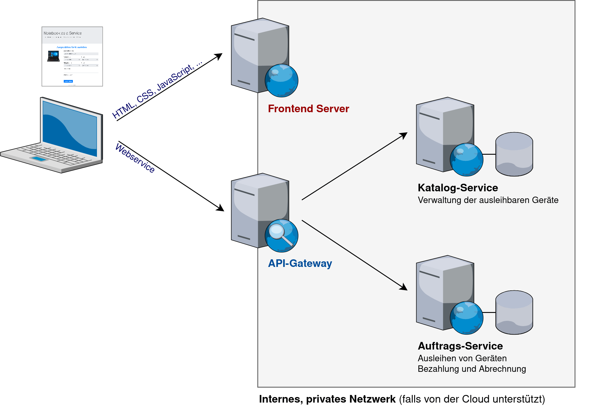

Fallbeispiel: Notebook as a Service
===================================

1. [Kurzbeschreibung](#kurzbeschreibung)
1. [Verzeichnisstruktur](#verzeichnisstruktur)
1. [Start der Services](#start-der-services)
1. [Versuche](#versuche)

<table>
    <tr>
        <td>
            <a href="screenshot1.png">
                
            </a>
        </td>
        <td>
            <a href="screenshot2.png">
                
            </a>
        </td>
        <td>
            <a href="screenshot3.png">
                
            </a>
        </td>
    </tr>
    <tr>
        <td>Screenshot der Webanwendung</td>
        <td>Konsolenausgaben des API-Gateways</td>
        <td>Übersichtsseite des API-Gateways</td>
    </tr>
</table>

Bilder zum Vergößern bitte anklicken.


Kurzbeschreibung
----------------

Dies ist die im Skript beschriebene Beispielanwendung „Notebook as a Service”.
Es handelt sich um eine einfache Webanwendung, die es Mitarbeitern im Self-Service
ermöglicht, Laptops und Smartphones für den Dienstgebrauch auszuleihen. Hierfür kann
über die Weboberfläche ein Gerät ausgesucht und eine Buchung vorgenommen werden.

Die Anwendung besitzt eine einfache Microservice-Architektur, bei der die Anwendungsfunktionen
in mehrere Serveranwendungen zerschlagen wurden. Anstelle eines großen, „monolithischen”
Anwendungsservers, wie man ihn früher programmiert hätte, gibt es stattdessen folgende,
kleine Server:



* __Frontend-Server (Port 8000):__ Dient als einfacher Webserver, der die clientseitig benötigten
HTML, CSS und JavaScript-Dateien zur Verfügung stellt. Serverseitig gibt es keine Logik,
obwohl dies im Sinne des „Backend for Frontend“ (BFF) Architekturansatzes durchaus
möglich wäre.

* __API-Gateway (Port 8010):__ Dies ist ein einfacher HTTP Reverse Proxy, der die Backendservices
nach außen hin verschattet. Die Backend-Server können dadurch über eine einheitliche
URL aufgerufen werden, ohne die genaue Backendstruktur kennen zu müssen. Im Idealfall
sorgt die Ausführumgebung durch ein virtuelles, privates Netzwerk sogar dafür, dass
die Backendservices aus dem öffentlichen Internet gar nicht direkt aufrufbar sind.

* __Katalog-Backend (Port 8020):__ Stellt eine einfache Datenbank für den Produktkatalog zur Verfügung.
In der Beispielanwendung verwaltet dieser Service die ausleihbaren Geräte.

* __Auftrags-Service (Port 8030):__ Wickelt den Bestellvorgang ab und verwaltet die Bestellungen
in seiner eigenen kleinen Datenbank. Kommuniziert hierfür mit dem Katalog-Backend,
um zu prüfen, ob die bestellten Geräte tatsächlich vorhanden sind.

Der Einfachheit halber sind alle Services in Node.js mit dem [Express-Framework](http://expressjs.com/)
realisiert. Somit wird nur Node.js benötigt, um die Anwendung auszuführen.

In dieser Aufgabe geht es nicht darum, den Quellcode zu verstehen, auch wenn Sie natürlich
gerne reinschauen können, wenn Sie neugierig sind. Viel mehr sollen Sie die untenstehenden
Versuche ausführen, um eine Microservice-Architektur mit API-Gateway und Load Balancing
praktisch zu kennenzulernen.

Verzeichnisstruktur
-------------------

Die Verzeichnisstruktur ist relativ einfach. Jedes Unterverzeichnis entspricht im
Grunde genommen einem Microservice:

 * `frontend`: Frontend-Server
 * `api-gateway`: API-Gateway
 * `catalogue-backend`: Katalog-Service
 * `order-backend`: Auftrags-Backend

Um die Programmierung zu vereinfachen, befindet sich im Verzeichnis `common` geteilter
Quellcode, der von allen Services verwendet wird.

Start der Services
------------------

Zunächst müssen im Hauptverzeichnis und in den Unterverzeichnissen die Node-Module installiert
werden. Am einfachsten geht dies mit folgenden Befehlen:

```sh
# Installation der Node-Module im Hauptverzeichnis
npm install

# Installation der Node-Module der einzelnen Services
npm run install

# Oder statt "npm run install"
cd frontend
npm install
cd ../api-gateway
npm install
cd ../catalogue-service
npm install
cd ../order-service
npm install
```

Danach können die Services in beliebiger Reihenfolge gestartet werden. Im ersten Wurf kann dies
mit folgendem Befehl im Hauptverzeichnis geschehen:

```sh
npm start
```

Er startet alle Services und zeigt ihre Meldungen im selben Terminalfenster.

Für die späteren Versuche sollte jedoch jeder Service in seinem eigenen Terminalfenster gestartet
werden. Hierfür muss dann in das jeweilige Unterverzeichnis gewechselt und dort `npm start` ausgeführt
werden. Das Ergebnis sieht dann wie im zweiten Screenshot oben aus. Zum Beispiel:

```sh
cd api-gateway
npm start
```

Versuche
--------

Probieren Sie folgende Dinge aus, um die Microservice-Architektur zu erforschen:

1. Führen Sie im Hauptverzeichnis des Beispiels den Befehl `npm start` aus, um alle Services
   zu starten. Beobachten Sie dabei die Konsolenausgaben.
   
   > Woran erkennen Sie, welche Protokollzeile zu welchem Service gehört?
   
1. Rufen Sie nun die Adresse [http://localhost:8000](http://localhost:8000) im Browser auf,
   um die Anwendung zu testen. Spielen Sie den Ausleihprozess einmal komplett durch und
   beobachten Sie die Protokollausgaben im Konsolenfenster.
   
   > Welche Aktionen führen zu einer Anfrage an das API-Gateway und welche zu einer Anfrage an
   > den Frontend-Server?

1. Rufen Sie nun die Adressen [http://localhost:8020](http://localhost:8020) und
   [http://localhost:8030](http://localhost:8030) im Browser auf, um die beiden Backendservices
   in Isolation zu testen. Klicken Sie auf die Links in der Übersichtsseite, um einfache
   GET-Anfragen an die Services zu schicken.
   
   > Woran erkennen Sie, dass es sich um Webservices und keine Webanwendungen handelt?

1. Rufen Sie nun die Adresse [http://localhost:8010](http://localhost:8010) auf, um die
   Services über das API-Gateway anzusprechen. Klicken Sie wieder auf die Links in der
   Übersichtsseite, um ein paar GET-Anfragen an die Services zu schicken. Beobachten Sie
   dabei die Protokollausgaben im Konsolenfenster.
   
   > Woher weiß das API-Gateway, an welchen Backendserver eine Anfrage weitergeleitet werden muss?

   > Wie ändert sich die URL bei einer erfolgreichen Weiterleitung?

1. Öffnen Sie die Datei `api-gateway/config/example.yml` in einem Editor und versuchen Sie,
   diese nachzuvollziehen.
   
   > In wiefern bestätigen sich Ihre Antworten zu letzten Frage hierdurch?

1. Schließen Sie sich in Zweiergruppen zusammen und versuchen Sie, die Services auf mehreren
   Rechnern auszuführen. Kopieren Sie hierfür die Datei `api-gateway/config/example.yml`
   nach `api-gateway/config/exercise.yml` und nehmen folgende Änderungen darin vor:

     1. Kommentieren Sie in den Weiterleitungsregeln die weiteren Instanzen für den Katalog-Service
        ein. Es handelt sich um eine einfache Load-Balancing-Konfiguration, bei der alle Anfragen
        auf drei Backend-Instanzen aufgeteilt werden.

     1. Passen Sie die Weiterleitungsregeln so an, dass die Backend-Services nicht auf `localhost`
        sondern auf einem fremden Rechner laufen. Ersetzen Sie das Wort `localhost` hierfür durch
        die IP-Adresse des fremden Rechners. Achten Sie jedoch darauf, die Portnummern beizubehalten!
   
1. Starten Sie nun auf dem eigenen Rechner Frontend und API-Gateway, und auf dem anderen Rechner
   die Backend-Services:

   <table>
       <tr>
           <td colspan="4"><b>Rechner 1</b>
       </tr>
       <tr>
           <td>
               Konsolenfenster 1
               <pre>cd frontend<br>npm start</pre>
           </td>
           <td>
               Konsolenfenster 2
               <pre>cd api-gateway<br>npm start:exercise</pre>
           </td>
           <td></td>
           <td></td>
       </tr>
       <tr>
           <td colspan="4"><b>Rechner 2</b>
       </tr>
       <tr>
           <td>
               Konsolenfenster 1
               <pre>cd catalogue-service<br>npm start</pre>
           </td>
           <td>
               Konsolenfenster 2
               <pre>cd catalogue-service<br>npm start1</pre>
           </td>
           <td>
               Konsolenfenster 3
               <pre>cd catalogue-service<br>npm start2</pre>
           </td>
           <td>
               Konsolenfenster 4
               <pre>cd order-service<br>npm start</pre>
           </td>
       </tr>
   </table>

   Im Gegensatz zu davor sollten Sie auf dem zweiten Rechner nun drei Instanzen des
   Katalog-Services laufen haben, die auf den Ports 8020, 8021 und 8022 aufrufbar sind.

1. Rufen Sie die Adresse [http://localhost:8000](http://localhost:8000) im Browser auf, um
   die Anwendung erneut zu testen. Spielen Sie den Bestellvorgang einmal komplett durch.
   Es sollte zu keinen Fehlern kommen.
   
   > Welche Anfragen an den Katalogservice wurden von welcher Instanz verarbeitet?

1. Zum Schluss wollen wir noch die Ausfallsicherheit der Anwendung überprüfen. Denn zumindest
   der Katalog-Service ist dreifach redundant ausgelegt. Öffnen Sie daher die Adresse
   [http://localhost:8010](http://localhost:8010) im Browser und klicken Sie auf die Links,
   um ein paar Anfragen gegen den Katalog-Service zu schicken. Beenden Sie dann nach und nach
   eine weitere Instanz des Katalogservices und schicken Sie wieder ein paar Anfragen über das
   API-Gateway.
   
   > Wie verhält sich das API-Gateway, wenn eine Instanz nicht erreicht werden kann?

   > Wie verhält sich das API-Gateway, wenn keine Instanz erreicht werden kann?