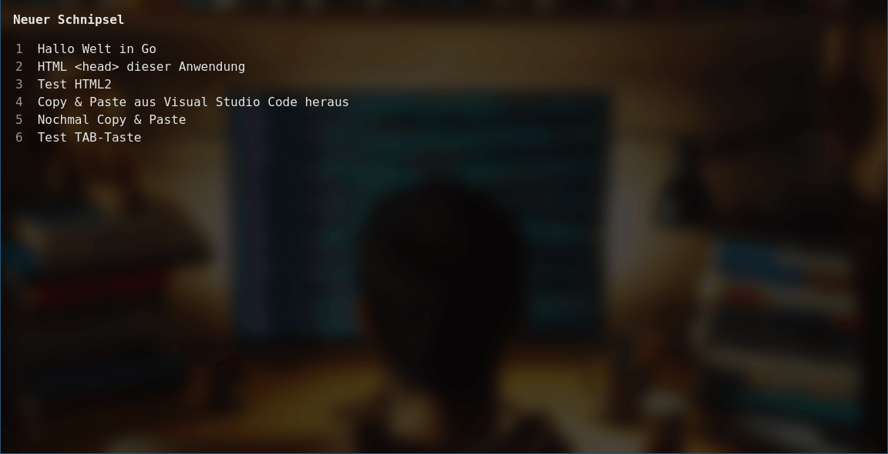
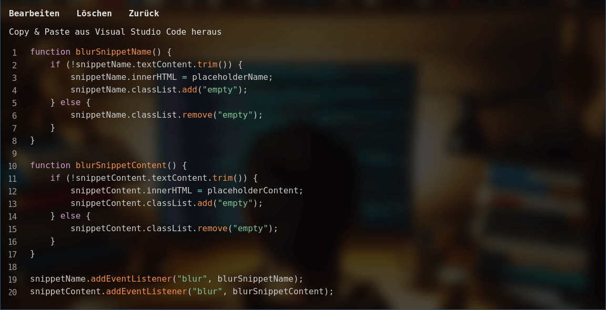

Aufgabe: Wastebin
=================

1. [Kurzbeschreibung](#kurzbeschreibung)
1. [Datenmodell](#datenmodell)
1. [REST-Webservice](#rest-webservice)

<table>
    <tr>
        <td>
            <a href="screenshot1.png">
                
            </a>
        </td>
        <td>
            <a href="screenshot2.png">
                
            </a>
        </td>
    </tr>
    <tr>
        <td>Startseite</td>
        <td>Codeschnipsel</td>
    </tr>
</table>

Bilder zum Vergrößern bitte anklicken.

Kurzbeschreibung
----------------

Kennen Sie [Pastebin](https://pastebin.com/)? Oder [Hastebin](https://hastebin.wiuwiu.de/)?
Oder [GitHub Gist](https://gist.github.com/)? Oder …? Sie bieten alle dieselbe Funktion:
Codeschnipsel online zu speichern und über eine Kurz-URL zu teilen. Das klingt einfach gung,
damit wir es als Übung nachprogrammieren wollen. Auch wenn uns hierbei vor allem auf den
REST-Webservice konzentrieren und die Sharing-Funktion zunächst ignorieren. Und da es sich
ja meistens, um Wegwerfschnipsel handelt, nennen wir diese Anwendung in Anlehnung an das
Original stolz **Wastebin**.

Diese Übung dient als Fallbeispiel für die Programmierung eines einfachen REST-Webservices
mit Datenpersistenz. In den kommenden Vorlesungen werden wir alle Schritte von der Anlage
des Projekts bis zur Ausprogrammierung des Webservices nachvollziehen. Der Quellcode im
Verzeichnis `Aufgabe` dient uns dabei als Grundlage, in der vor allem bereits die Single
Page App mit der Benutzeroberfläche vollständig enthalten ist.

Die Anwendung kann unter dem Link [http://localhost:9000/](http://localhost:9000/) im
Browser gestartet werden.

Datenmodell
-----------


Das Datenmodell könnte einfacher nicht sein. Es gibt lediglich Codeschnipsel, die neben
einer ID eine Namen und etwas Textinhalt besitzen. Zusätzlich sind sie über einen Fremdschlüssel
mit einer Programmiersprache verknüpft, damit die Codeschnipsel bei der Anzeige korrekt
eingefärbt werden können (Syntax Highlighting).

REST-Webservice
---------------

Der REST-Webservice bildet das Datenmodell ziemlich geradlinig auf ein paar HTTP-Endpunkte
ab. Entsprechend der REST-Prinzipien wird dabei zwischen Collections als Sammlung von
Codeschnipseln oder Programmiersprachen sowie Ressourcen als einzelne Einträge der
Collections unterschieden.

| Beschreibung         |**URL-Pfad**        | `GET` | `POST` | `PUT` | `PATCH` | `DELETE` |
|----------------------|--------------------| :---: | :---:  | :---: | :---:   | :---:    |
| Sprach-Collection    | `/api/language`    | X     |        |       |         |          |
| Schnipsel-Collection | `/api/snippet`     | X     | X      |       |         |          |
| Schnipsel-Ressource  | `/api/snippet/:id` | X     |        | X     | X       | X        |

* Die Programmiersprachen können nur als Liste abgerufen werden. Die Liste kann nicht
  durchsucht werden und es werden keine weiteren Operationen unterstützt. Denn mehr
  Funktionen benötigt die Benutzeroberfläche derzeit nicht.

* Für Codeschnipsel gilt, dass `GET`-Anfragen an die Collection eine Liste der gefundenen
  Datensätze liefern. Über den optionalen URL-Parameter `q` kann die Liste dabei nach
  beliebigen Suchbegriffen eingegrenzt werden.

* `POST`-Anfragen an die Schnipsel-Collection dienen der Anlage neuer Datensätze.

* `GET`/`PUT`/`PATCH`/`DELETE`-Anfragen werden hingegen an einen einzelnen Codeschnipsel
  geschickt, um diesen komplett auszulesen, zu ändern oder zu löschen.

Alle Daten werden im JSON-Format kodiert.

Die Sprachliste hat folgenden Aufbau:

```json
[
    {"language": "",     "label": "Nur Text"},
    {"language": "http", "label": "HTTP"},
    {"language": "html", "label": "HTML"},
    ...
]
```

Die Liste der gefundenen Schnipsel hat folgenden Aufbau:

```json
[
    {"id": 1, "language": "go",  "name":"Hallo Welt in Go"},
    {"id": 2, "language": "css", "name":"Test für Copy & Paste"},
    ...
]
```

Ein einzelner Schnipsel ist ähnlich aufgebaut, enthält darüber hinaus aber noch
die Sprache und den Textinhalt:

```json
{
    "id":       1,
    "language": "go",
    "name":     "Hallo Welt in Go",
    "content":  "package main\n\nimport \"fmt\"..."
}
```