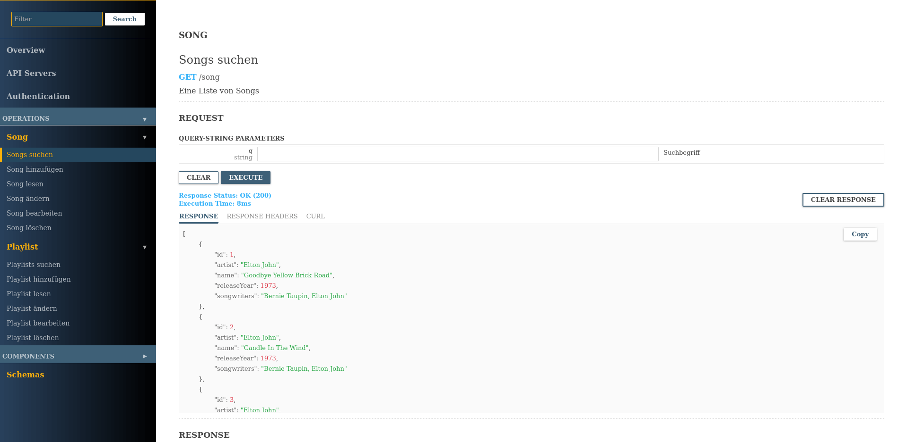

Musikdatenbank
==============

1. [Kurzbeschreibung](#kurzbeschreibung)
1. [Start des Servers](#start-des-servers)
1. [Aufgabenstellung](#aufgabenstellung)
1. [Fragen zur Programmierung](#fragen-zur-programmierung)

<kbd>
    
</kbd>

Kurzbeschreibung
----------------

Dieses Beispiel zeigt, wie mit [Node.js](https://nodejs.org/) und dem
[Express-Framework](http://expressjs.com/) ein einfacher REST-Webservice
entwickelt werden kann. Es handelt sich dabei um eine kleine Musikdatenbank
mit folgendem Datenmodell:


Entsprechend den REST-Prinzipien besitzt der Webservice folgende Endpunkte:

| Beschreibung        |**URL-Pfad**     | `GET` | `POST` | `PUT` | `PATCH` | `DELETE` |
|---------------------|-----------------| :---: | :---:  | :---: | :---:   | :---:    |
| Song-Collection     | `/song`         | X     | X      |       |         |          |
| Song-Ressource      | `/song/:id`     | X     |        | X     | X       | X        |
| Playlist-Collection | `/playlist`     | X     | X      |       |         |          |
| Playlist-Ressource  | `/playlist/:id` | X     |        | X     | X       | X        |

* `GET`-Anfragen an eine Collection liefern eine Liste der gefundenen Datensätze. Über
  den optionalen URL-Parameter `q` kann die Liste nach beliebigen Suchbegriffen
  eingegrenzt werden.

* `POST`-Anfragen an eine Collection dienen der Anlage neuer Datensätze.

* `GET`/`PUT`/`PATCH`/`DELETE`-Anfragen an eine Ressource dienen dem Lesen, Bearbeiten und
  Löschen einzelner Datensätze.

Über die eingebaute Weboberfläche (OpenAPI Explorer) kann der Webservice vollständig
im Browser getestet werden.

Start des Servers
-----------------

Es handelt sich um ein einfaches Node.js-Projekt. Dementsprechend müssen einmalig
mit `npm install` die benötigten Node-Pakete installiert werden, bevor der Server
mit `npm start` gestartet werden kann. Der Server ist anschließend unter der URL
[http://localhost:9000/](http://localhost:9000/) erreichbar.

Aufgabenstellung
----------------

Testen Sie den Webservice über die eingebaute Webanwendung oder mit einem Testwerkzeug
wie [HTTPie](https://httpie.io/) oder dem [Talend API Tester](https://chromewebstore.google.com/detail/talend-api-tester-free-ed/aejoelaoggembcahagimdiliamlcdmfm).
Führen Sie folgende Aktionen aus:

1. Rufen Sie eine Liste aller Songs ab.

1. Filtern Sie die Liste anschließend nach allen Songs von Elton John.

1. Senden Sie eine POST-Anfrage zum Anlegen folgendes Songs:

   ```json
   {
     "name": "Circle of Life",
     "artist": "Elton John",
     "songwriters": "Tim Rice",
     "releaseYear": 1994,
   }
   ```

1. Ändern Sie mit einer PATCH-Anfrage die Songwriter auf "Elton John and Tim Rice".

1. Ändern Sie mit einer PUT-Anfrage den Titel zu "Circle of Life (from Lion King)".

1. Rufen Sie erneut alle Songs von Elton John ab und prüfen Sie, ob der neue Song enthalten ist.

Fragen zur Programmierung
-------------------------

1. Im Quellcode gibt es eine Trennung nach `controller` und `service`-Modulen.
   Was könnte der Grund hierfür sein und welche Vorteile ergeben sich hieraus?

   **Tipp:** Schauen Sie sich zum Beispiel den Controller und den Service für
   Songs an und überlegen sie, welche Aufgaben in den beiden Dateien jeweils
   umgesetzt werden. Schauen Sie dann, wie die beiden Dateien in Zusammenhang
   zueinander stehen. Dies sollte Ihnen bereits einen guten Hinweis geben.
   Anschließend fragen Sie einen KI-Sprachassistenten wie ChatGPT und vergleichen
   die Antwort mit Ihren Überlegungen.

2. Der Quellcode der beiden Controller-Module ist nahezu identisch. In welchen
   Punkten unterscheiden sie sich und welche Möglichkeiten fallen Ihnen ein,
   wie der doppelte Code vermieden werden könnte?