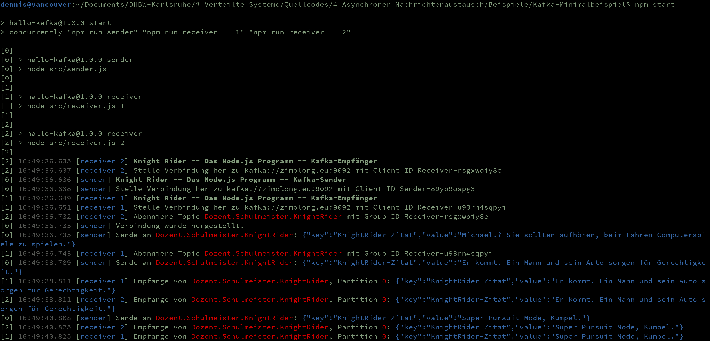

Kafka-Minimalbeispiel
=====================

1. [Kurzbeschreibung](#kurzbeschreibung)
1. [Sender und Empfänger zusammen starten](#sender-und-empfänger-zusammen-starten)
1. [Sender und Empfänger einzeln starten](#sender-und-empfänger-einzeln-starten)

Kurzbeschreibung
----------------

Dieses Beispiel zeigt, wie (nicht ganz so) einfach ein Node.js-Programm sich mit einem
[Apache Kafka](https://kafka.apache.org) Broker verbinden kann, um asynchrone Nachrichten
auszutauschen. Es ist im Grunde genommen dasselbe Beispiel wie für MQTT, nur eben mit
Kafka statt MQTT. Das `src`-Verzeichnis beinhaltet hierfür zwei Programme, von denen eines
regelmäßig Nachrichten an ein Topic sendet, die das andere Programm empfängt. Der Sender
simuliert dabei eine typische Folge der 80er-Jahre Action Serie [Knight Rider](https://de.wikipedia.org/wiki/Knight_Rider),
indem typische Zitate der Serie gepostet werden.

Der Nachrichtenaustausch via Kafka setzt einen zentralen Message Broker voraus, mit dem sich
alle Programme verbinden können. In der Datei `.env` ist hierfür der für die Vorlesung
vorgesehene Broker kafka://zimolong.eu:9092 voreingestellt. Leider kann dieser aber nicht
aus dem DHBW-Netz erreicht werden, da die Firewall den Port blockiert und Kafka (anders als
MQTT) nicht über HTTP/Websockets angesprochen werden kann. Generell ist bei Kafka alles viel
umständlicher als bei MQTT. :-)

Wie für den asynchronen Nachrichtenaustausch typisch gibt es keine Beschränkung, wie viele Sender
und Empfänger gestartet werden. Am besten funktioniert das Beispiel jedoch, wenn ein Sender und
mehrere Empfänger gestartet werden, wobei die Empfänger ein optionales Load Balancing unterstützen.

_**Anmerkung zum Load Balancing:** Im Versuch hat dies nicht sonderlich gut funktioniert, da der
Kafka Broker häufig in einen „Rebalancing“-Zustand gerät, wenn sich neue Clients mit derselben
Group Id anmelden, um die Nachrichten aufzuteilen. Dadurch wurden einige Nachrichten erst bei einem
späteren Neustart der Clients empfangen._

Sender und Empfänger zusammen starten
-------------------------------------

Für einen schnellen Test, können mit folgenden Befehlen ein Sender und zwei Empfänger im selben
Konsolenfenster gestartet werden. Die Logausgaben werden durch eine vorangestellte Nummer den
einzelnen Prozessen zugeordnet:

* `npm run start`: Ein Sender, zwei Empfänger, kein Load Balancing
* `npm run start-lb`: Ein Sender, zwei Empfänger, mit Load Balancing

Sender und Empfänger einzeln starten
------------------------------------

Sender und Empfänger können mit folgenden Befehlen getrennt gestartet werden:

* `npm run sender`: Sender starten
* `npm run receiver`: Empfänger starten

Sollen mehrere Empfänger gestartet werden, kann ihnen zur Unterscheidung ein Postfix-String
oder eine Laufnummer mitgegeben werden:

* `npm run receiver -- 1`
* `npm run receiver -- 2`
* `npm run receiver -- 3`

In diesem Beispiel erhalten alle Empfänger alle Nachrichten. Wird dem Befehl noch `lb` angehängt,
findet ein automatisches Load Balancing statt, so dass jede Nachricht nur an einen Empfänger geht:

* `npm run receiver -- 1 lb`
* `npm run receiver -- 2 lb`
* `npm run receiver -- 3 lb`