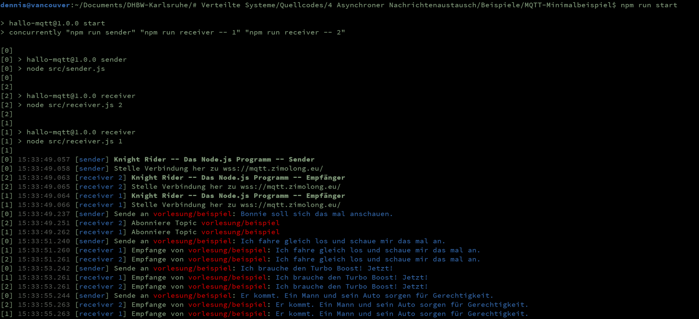

MQTT-Minimalbeispiel
====================

1. [Kurzbeschreibung](#kurzbeschreibung)
1. [Sender und Empfänger zusammen starten](#sender-und-empfänger-zusammen-starten)
1. [Sender und Empfänger einzeln starten](#sender-und-empfänger-einzeln-starten)

Kurzbeschreibung
----------------

Dieses Beispiel zeigt, wie einfach ein Node.js-Programm das MQTT-Protokoll nutzen kann, um
asynchrone Nachrichten auszutauschen. Das `src`-Verzeichnis beinhaltet hierfür zwei Programme,
von denen eines regelmäßig Nachrichten an ein Topic sendet, die das andere Programm empfängt.
Der Sender simuliert dabei eine typische Folge der 80er-Jahre Action Serie [Knight Rider](https://de.wikipedia.org/wiki/Knight_Rider),
indem typische Zitate der Serie gepostet werden.

Der Nachrichtenaustausch via MQTT setzt einen zentralen Message Broker voraus, mit dem sich
alle Programme verbinden können. In der Datei `.env` ist hierfür der für die Vorlesung
vorgesehene Broker wss://mqtt.zimolong.eu/ voreingestellt, da dieser auch aus dem DHBW-Netz
erreicht werden kann.

Wie für MQTT typisch gibt es keine Beschränkung, wie viele Sender und Empfänger gestartet werden.
Am besten funktioniert das Beispiel jedoch, wenn ein Sender und mehrere Empfänger gestartet werden,
wobei die Empfänger ein optionales Load Balancing durch sog. „Shared Subscriptions“ unterstützen.

Sender und Empfänger zusammen starten
-------------------------------------

Für einen schnellen Test, können mit folgenden Befehlen ein Sender und zwei Empfänger im selben
Konsolenfenster gestartet werden. Die Logausgaben werden durch eine vorangestellte Nummer den
einzelnen Prozessen zugeordnet:

* `npm run start`: Ein Sender, zwei Empfänger, kein Load Balancing
* `npm run start-lb`: Ein Sender, zwei Empfänger, mit Load Balancing

Sender und Empfänger einzeln starten
------------------------------------

Sender und Empfänger können mit folgenden Befehlen getrennt gestartet werden:

* `npm run sender`: Sender starten
* `npm run receiver`: Empfänger starten

Sollen mehrere Empfänger gestartet werden, kann ihnen zur Unterscheidung ein Postfix-String
oder eine Laufnummer mitgegeben werden:

* `npm run receiver -- 1`
* `npm run receiver -- 2`
* `npm run receiver -- 3`

In diesem Beispiel erhalten alle Empfänger alle Nachrichten. Wird dem Befehl noch `lb` angehängt,
findet ein automatisches Load Balancing statt, so dass jede Nachricht nur an einen Empfänger geht:

* `npm run receiver -- 1 lb`
* `npm run receiver -- 2 lb`
* `npm run receiver -- 3 lb`