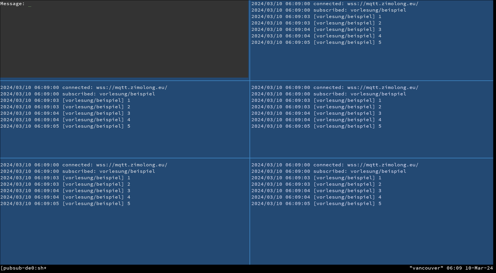
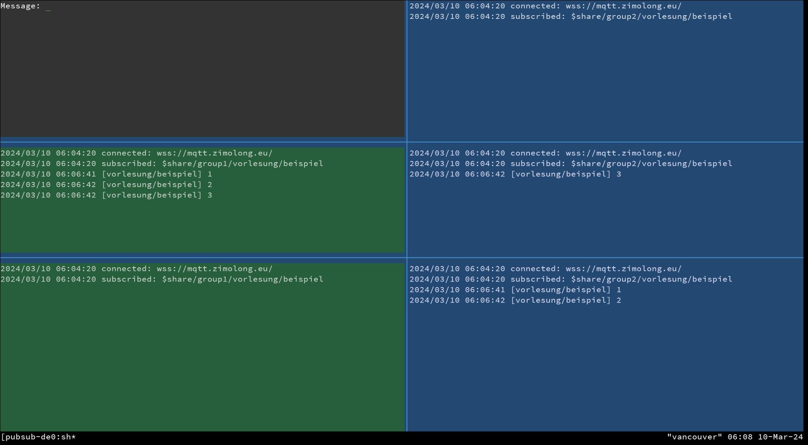

Terminal-Demo für den asynchronen Nachrichtenaustausch
======================================================

1. [Kurzbeschreibung](#kurzbeschreibung)
1. [Voraussetzungen](#voraussetzungen)
1. [Start der Beispiele](#start-der-beispiele)

<table>
    <tr>
        <td>
            
        </td>
        <td>
            
        </td>
    </tr>
    <tr>
        <td>Einfaches Publish/Subscribe</td>
        <td>Clientseitige Lastverteilung</td>
    </tr>
</table>

Bilder zum Vergrößern bitte anklicken.

Kurzbeschreibung
----------------

Dieses Beispiel beinhaltet zwei Shell-Skripte, mit denen die Funktionsweise
einer einfachen Publish/Subscribe-Kommunikation demonstriert bzw. ausprobiert
weren kann:

* `demo-pubsub.sh`: Zeigt ein einfaches Publish/Subribe, bei der jede Nachricht
  an alle zum gegenenen Zeitpunkt aktiven Empfänger geht.

* `demo-load-balancing.sh`: Zeigt eine erweiterte Version des Beispiels, bei
  der sich zwei "Subscription Groups" die Nachrichten untereinander aufteilen.
  Gemeint ist, dass jede Gruppe aus mehreren laufenden Prozessen besteht, von
  denen nur jeweils einer eine Nachricht zugestellt bekommt.

Als Grundlage hierfür dient ein einfacher MQTT-Server auf zimolong.eu, der
auch aus dem DHBW-Netz erreichbar sein sollte.

Voraussetzungen
---------------

Die Beispiele wurden unter Linux entwickelt und setzen ein vergleichbare
Umgebung voraus: Windows Subsystem for Linux oder MacOS sollten problemlos
funktionieren. Lediglich folgendes muss vorhanden sein:

1. Eine Posix-Shell
1. `tmux`
1. `mqttcli`

`tmux` dient dem Aufteilen des Konsolenfensters und `mqttcli` stellt die
beiden Programme `pub` und `sub` für einfache Experimente mit MQTT bereit.
Unter Fedora Linux kann es mit `sudo dnf install mqttcli` installiert
werden. Andere Distributionen sollten es ebenfalls beinhalten. Vorsicht:
Da es mehrere Projekte mit dem Namen MQTT CLI gibt, lässt sich das Projekt
mit Google schlecht finden. Die Webseite lautet: https://git.sr.ht/~spc/mqttcli

Start der Beispiele
-------------------

Die Beispiele können mit dem beiden Shell-Skripten `demo-pubsub.sh` und
`demo-load-balancing.sh` gestartet werden. Beide verbinden sich über eine
Websocket-Verbindung mit dem MQTT-Server auf wss://zimolong.eu/. Dies sollte
auch aus dem DHBW-Netz funktionieren. Als Topic wird jeweils `vorlesung/beispiel`
verwendet.
