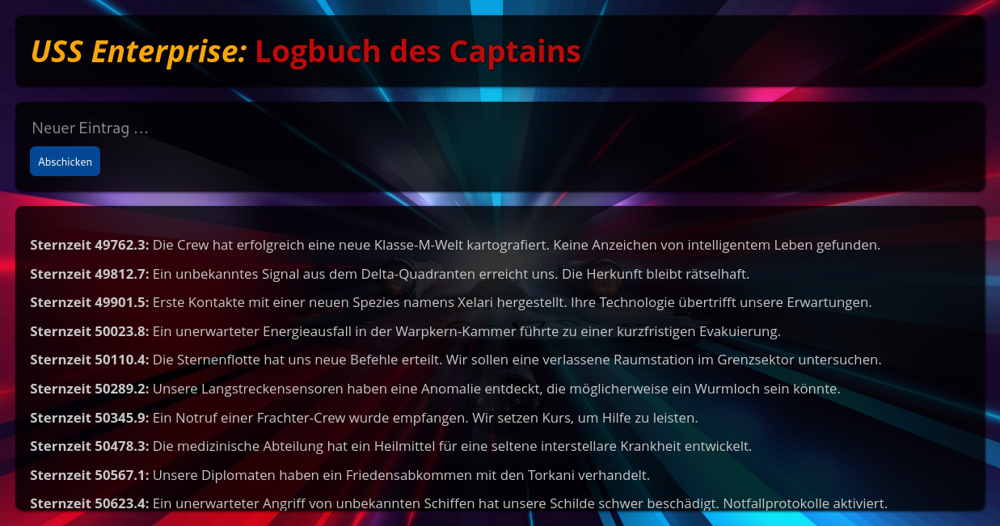

Logbuch des Captains
====================

In dieser Aufgabe wollen wir unsere frisch erworbenen Kenntnisse in Node.js und Express
anwenden, und eine kleine Webanwendung mit Webservice-Backend entwickeln. Die Single Page
App der Benutzeroberfläche ist dabei schon fertig. Es fehlt lediglich noch der HTTP-Server,
über welchen die Webseite abgerufen und mit einer kleinen Datenbank kommuniziert werden kann.
Folgende Dinge müssen hierfür in der Date `src/main.js` umgesetzt werden:

1. Import von `dotenv` und Aufruf von `dotenv.config()` um die Datei `.env` mit zusätzlichen
   Umgebungsvariablen einzulesen.

1. Einlesen der Umgebungsvariablen `LISTEN_HOST` und `LISTEN_PORT`.

1. Erzeugen eines `logger` und eines `app`-Objekts, wie im Skript und den Beispielen gezeigt.

1. Registrieren einer Middleware-Funktion, die alle HTTP-Anfragen auf der Konsole logt.

1. Statische Dateien aus dem `static`-Verzeichnis über den Server abrufbar machen.

1. Sicherstellen, dass der Server mit Anfragen und Antworten im JSON-Format umgehen kann.

1. Ausprogrammieren des Endpunkts `GET /api/logbook` zum Auslesen aller Logeinträge.

1. Ausprogrammieren des Endpunkts `POST /api/loogook` zum Anlegen eines neuen Logeintrags.

Der Server lässt sich mit den Befehlen `npm start` bzw. `npm watch` starten und über die
Adresse [http://localhost:9000](http://localhost:9000) aufrufen.

Die Logbucheinträge sollen mit dem in der Datei `database.js` exportierten `db`-Objekt
gelesen und geschrieben werden. Dieses nutzt die Bibliothek [lowdb](https://www.npmjs.com/package/lowdb)
zur Simulation einer einfachen Datenbank im Stil von MongoDB.