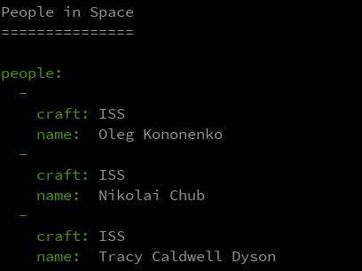

Erste Schritte mit Node.js
==========================

Dieses Beispiel zeigt die ersten Schritte der Backend-Programmierung mit Node.js.
Im Vorlesungsskript wird das Programm von der Anlage des Projekts bis zur finalen
Version mit mehreren Quelldateien Schritt für Schritt erarbeitet:

1. Anlegen des neuen Projekts mit `npm init` und Bedeutung der Datei `package.json`
1. Definieren und Ausführen von NPM Run Scripts
1. Suchen, Hinzufügen und Entfernen von Abhängigkeiten
1. Abruf interessanter JSON-Daten von einer öffentichen Quelle im Netz
1. Debuggen des Quellcodes mit Visual Studio Code
1. Aufteilen des Quellcodes in mehrere Module (Quellcodedateien)

Mögliche Vertiefungen, die beispielsweise mit ChatGPT erkundet werden können:

1. `async`/`await`-Syntax zur Arbeit mit `Promise`-Objekten
1. `try`/`catch` bzw. Exception-Handling in JavaScript
1. Vermeidung von Programmierfehlern mit TypeScript