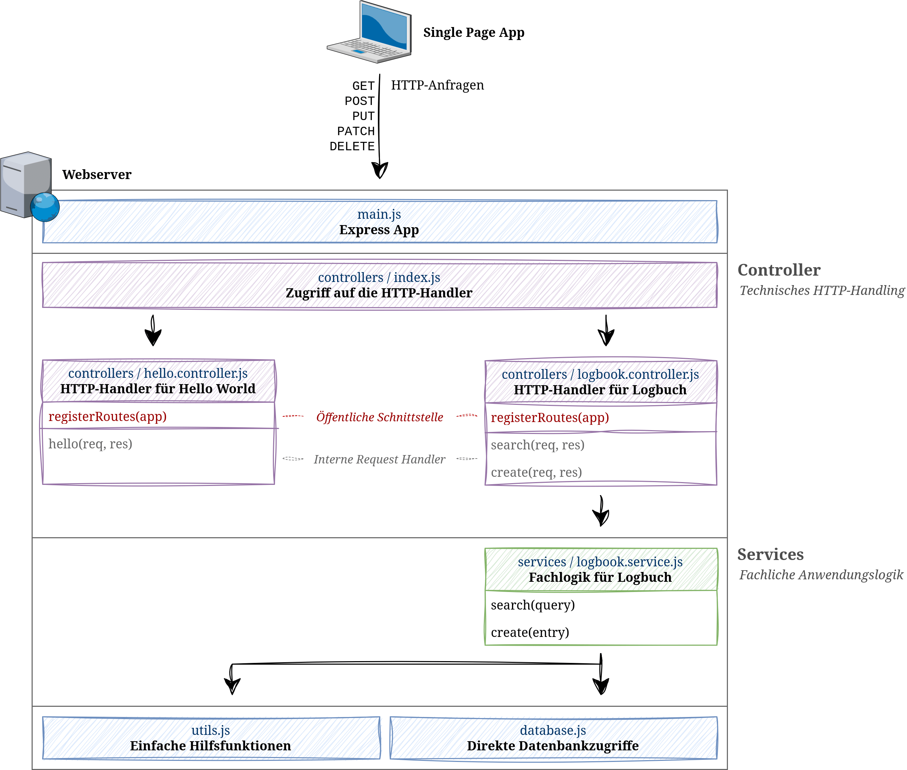
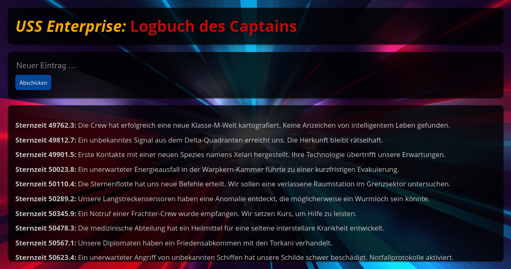

Logbuch des Captains
====================

Dies ist eine erweiterte Version der Musterlösung zur Aufgabe [Logbuch des Captains](../../Aufgaben/Logbuch%20des%20Captains/),
die zeigt, wie sich der Quellcode unter Anwendung der SOLID-Prinzipien besser strukturieren lässt.
Diese Version kann aus Vorlage für eigene Webservices verwendet und leicht angepasst werden. Die
Abbildung unten zeigt die verbesserte Code-Struktur. Eine ausführliche Erklärung hierzu findet sich
im [Vorlesungsskript](https://www.wpvs.de/repo/vertsys-2024/skript/) unter der Überschrift
„Strukturierung des Quellcodes“.

Der Server lässt sich mit den Befehlen `npm start` bzw. `npm watch` starten und über die
Adresse [http://localhost:9000](http://localhost:9000) aufrufen.

