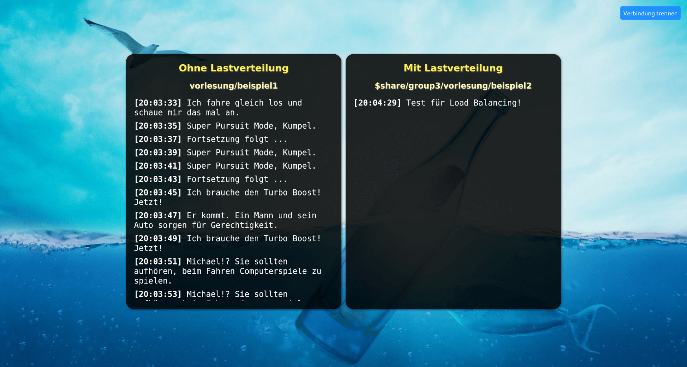

MQTT-Browserclient
==================

Dies ist eine Ergänzung zu den anderen MQTT-Beispielen, die zeigt, wie dieselbe Bibliothek,
die im MQTT-Minimalbeispiel in Node.js genutzt wurde, auch im Browser lauffähig ist, um aus
einer Single Page App heraus Nachrichten über einen MQTT-Broker zu senden und zu empfangen.

Die Anwendung ist dafür gedacht, im Unterricht als Ergänzung zur MQTT-Demo genutzt zu werden.
Bevor die Lehrperson mit der MQTT-Demo die Unterschiede zwischen regulärem Publish/Subscribe
und Lastverteilung mit „Shared Groups” demonstriert, öffnen die Studierenden die Browser-App
und drehen den Ton auf ihrem Laptop auf. So nimmt der ganze Vorlesungssaal an der Demonstration
teil, wobei die auf den Laptops abgespielten Signaltöne ("Bing...", wenn ein Laptop eine
Nachricht empfangen hat) sowohl die Lastverteilung als auch den Broadcast an alle Studierenden
akustisch unterstützen.

Die Webseite kann unter folgender URL direkt von GitHub aufgerufen werden:
[Aufruf der Webanwendung](https://dennisschulmeister.github.io/dhbwka-wwi-vertsys-2024-quellcodes/4%20Asynchroner%20Nachrichtenaustausch/Beispiele/MQTT-Browserclient/static/)