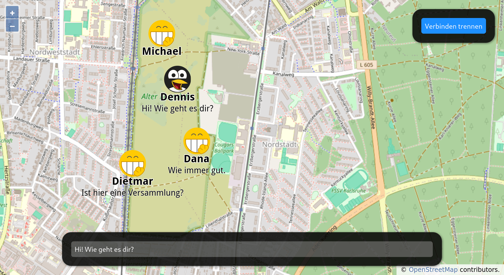
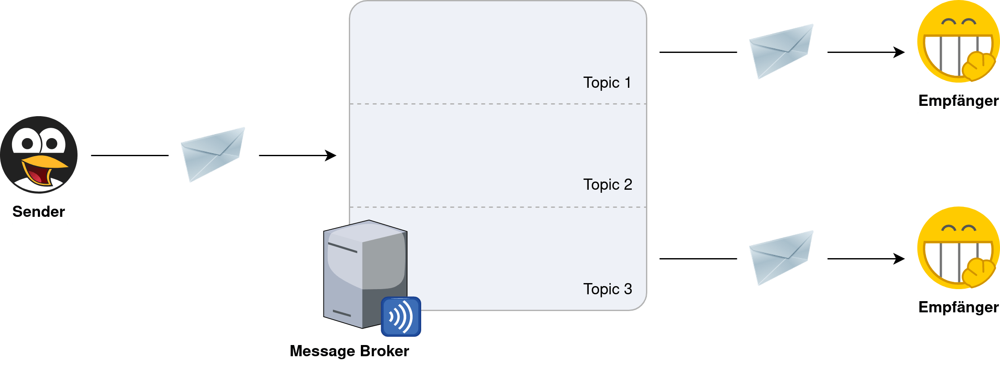

MQTT-SocialMap
==============

Die Webseite kann unter folgender URL direkt von GitHub aufgerufen werden:
[Aufruf der Webanwendung](https://dennisschulmeister.github.io/dhbwka-wwi-vertsys-2024-quellcodes/4%20Asynchroner%20Nachrichtenaustausch/Beispiele/MQTT-SocialMap/static/)

Dieses Beispiel dient als Einstiegsbeispiel für den asynchronen Nachrichtenaustausch. Indem alle Studierenden
am Anfang der Vorlesung die Webseite besuchen, erfahren sie direkt die Vorteile gegenüber dem klassischen
Request/Response-Modell:

 * Beliebig viele Sender und Empfänger gleichzeitig
 * Kommunikation in Echtzeit ohne merkliche Verzögerungen

Da eine TCP/IP-Verbindung aber immer nur zwischen zwei Hosts aufgebaut werden kann, wird die Kommunikation
über einen zentralen Message Broker abgewickelt. Dieser entkoppelt die Teilnehmer*innen voneinander, indem
er die Nachrichten empfängt und entsprechend den Wünschen der Empfänger weiterleitet.

Am deutlichsten wird der Vorteil dieser Architektur, wenn man sich vorstellt, wie derselbe Anwendungsfall
mit einem synchronen Request/Response-Mechanismus umgesetzt würde und welche Probleme sich daraus ergeben
könnten:

 * Jeder Knoten fragt regelmäßig beim Server nach neuen Nachrichten.
 * Die meiste Zeit wird es keine Geben, wodurch auf beiden Seiten Ressourcen vergeudet wurden.
 * Wenn aber neue Nachrichten eintreffen, vergeht eine unbestimmte Zeit, bis sie tatsächlich abgerufen werden.
 * Im Extremfall wird für jede Anfrage eine neue TCP/IP-Verbindung hergestellt, was weitere Zeit in Anspruch nimmt.
 * Skalierbarkeit und Ausfallsicherheit können nur umständlich realisiert werden.

Dem steht das asynchrone Modell entgegen:

 * Jeder Knoten ist dauerhaft mit dem Message Broker verbunden.
 * Bei Verbindungsabbrüchen wird die Verbindung automatisch wieder hergestellt.
 * Es gibt keine starren Konversationsmuster mit Anfrage und Antwort.
 * Die Knoten können jederzeit Nachrichten senden oder zugestellt bekommen.
 * Aus Absendersicht hat jede Nachricht eine unbekannte Anzahl an Empfängern.
 * Die Absender einer Nachricht treffen daher keine Annahmen, ob und wann sie verarbeitet werden.
 * Skalierbarkeit und Ausfallsicherheit sind in der Architektur bereits fest eingebaut.

Der zentrale Message Broker stellt hier, sofern er selbst nicht skalierbar und ausfallsicher betrieben wird,
einen Single Point of Failure dar. In kleinen Setup erhöht er zusätzlich die Gesamtkomplexität, so dass sich
sein Einsatz erst ab einer bestimmten Systemgröße oder bei Vorliegen besondere Anforderungen lohnt:

 * Das System muss sehr leicht erweiterbar sein.
 * Das System muss leicht skalierbar und ausfallsicher sein.
 * Viele Knoten müssen untereinander Nachrichten austauschen.
 * Die Knoten kennen sich untereinander jedoch nicht oder nicht vollständig.

Sind diese Anforderungen zumindest teilweise gegeben, gleichen die Vorteile des asynchronen Modells die
Nachteile durch das Hinzufügen einer weiteren Systemkomponente schnell aus.