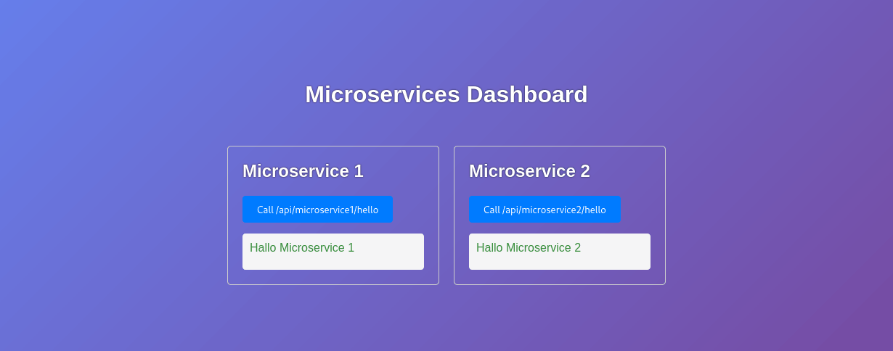

Vorlage: Microservices mit UI (Microservices + Express-Frontend)
================================================================

Inhaltsverzeichnis
------------------

- [Kurzüberblick](#kurzüberblick)
- [Los geht's!](#los-gehts)
- [Projektstruktur (Monorepo)](#projektstruktur-monorepo)
- [Teilprojekte: Schema & wichtigste Dateien](#teilprojekte-schema--wichtigste-dateien)
- [Konfiguration via `.env`](#konfiguration-via-env)
- [Proxy-Regeln (Frontend → Microservices)](#proxy-regeln-frontend--microservices)
- [Verwendung der Vorlage](#verwendung-der-vorlage)
- [Wichtige NPM-Kommandos](#wichtige-npm-kommandos)
- [Docker & Docker Compose](#docker--docker-compose)
- [Hinweise & typische Stolpersteine](#hinweise--typische-stolpersteine)



Kurzüberblick
-------------

Diese Vorlage zeigt, wie Sie eine Microservice-Architektur mit einem **separaten Frontend-Projekt**
aufbauen könnt, das gleichzeitig als **UI-Server** dient. Alle Teilprojekte sind **Express-Apps**
(wie in der Vorlesung besprochen). Dadurch kann das Frontend flexibel als **SPA**, **MPA** oder
**hybrid** umgesetzt werden.

Wichtiges Ziel dieser Vorlage: Im Browser gibt es **nur einen Einstiegspunkt** (das Frontend)!
Das Frontend kann per Proxy HTTP-Aufrufe an die Microservices weiterleiten – so müssen Sie sich
beim UI nicht mit CORS/mehreren Origins herumschlagen. Wünschen Sie, das UI komplett separat zu
entwickeln, ist dies ebenfalls möglich, da die entsprechenden CORS-Header vom Frontend-Server
gesetzt werden. In diesem Fall dient der Frontend-Server lediglich als API-Gateway, das alle
Zugriffe auf die Backend-Microservices kapselt.

* **Microservice 1** läuft standardmäßig auf Port **9000** und bietet beispielhaft `GET /api/hello`.
* **Microservice 2** läuft standardmäßig auf Port **9001** und bietet beispielhaft `GET /api/hello`.
* **Frontend** läuft standardmäßig auf Port **8888**, liefert statische Dateien aus und enthält Proxy-Routen:

	- `/api/microservice1/*` → Microservice 1
	- `/api/microservice2/*` → Microservice 2

Das Repo nutzt ein gemeinsames Paket **common/** als (NPM-)Workspace-Paket, um **Code und Dependencies**
zu teilen.

Los geht's!
-----------

Voraussetzungen: aktuelle Node.js-LTS + npm.

1) Dependencies installieren (im Projekt-Root):

```bash
npm install
```

2) Alle Teilprojekte starten:

```bash
npm start
```

Für die Entwicklung (Auto-Restart bei Änderungen):

```bash
npm run watch
```

3) Im Browser öffnen:

- UI/Frontend: http://localhost:8888/

Beispielaufrufe (über das Frontend, inkl. Proxy):

- http://localhost:8888/api/microservice1/hello
- http://localhost:8888/api/microservice2/hello

Direktzugriff auf die Microservices geht natürlich auch, z.B. http://localhost:9000/api/hello.
Im UI sollten Sie aber die Proxy-URLs nutzen.

Projektstruktur (Monorepo)
--------------------------

Auf Root-Ebene liegen Orchestrierung und gemeinsame Abhängigkeiten:

```text
.
├─ package.json            # Root-Scripts: start/watch für alle Teilprojekte
├─ common/                 # Geteiltes Paket (Workspace): Middleware, Utils, Dependencies
├─ microservice1/          # Beispiel-Microservice 1 (Express)
├─ microservice2/          # Beispiel-Microservice 2 (Express)
└─ frontend/               # Frontend/UI (Express + Proxy + static/)
```

Beachten Sie die `workspace`-Anweisung in der obersten `package.json`!

Teilprojekte: Schema & wichtigste Dateien
-----------------------------------------

### `common/` (geteilter Code + Dependencies)

* `common/package.json`
	- enthält bewusst die **gemeinsam genutzten Dependencies** (u.a. `express`, `dotenv`, `qs`, Logging)

* `common/src/utils.js`
	- `logger` und kleine Helpers wie `throwError()` / `throwNotFound()`

* `common/src/middleware.js`
	- `logRequest(logger)` (Request-Logging)
	- `handleError(logger)` (zentraler JSON-Error-Handler)

➡️ Idee: Alles, was mehrere Services brauchen (z.B. Middleware, Validatoren, DTOs, Fehlerklassen, Shared Config),
kommt in `common/`.

**Hinweis zur Dependency-Verwaltung:** In dieser Vorlage liegen zentrale Dependencies (z.B. `express`, `dotenv`, `qs`)
im `common/`-Paket. Darum wirken `microservice1/`, `microservice2/` und `frontend/` in ihrer jeweiligen `package.json`
teilweise „ungewöhnlich leer“ – das ist hier Absicht. Wenn Sie ein Paket **nur** in einem Service brauchen, installieren
und verwalten Sie es es ganz normal im entsprechenden Unterordner.

### `microservice1/` und `microservice2/` (Backend-Services)

Beide Microservices sind strukturell gleich aufgebaut:

* `src/main.js`
	- Express-Setup (JSON, Static, Logging, Error-Handling)
	- lädt Controller aus `src/controllers/index.js`
	- Standardports: **9000** bzw. **9001** (überschreibbar per `.env`)

* `src/controllers/`
	- `*.controller.js`: registriert Routen am Express-`app`
	- `index.js`: sammelt alle Controller in einem Array (damit `main.js` nicht dauernd angepasst werden muss)

* `src/services/`
	- fachliche Logik (wird von Controllern aufgerufen)

* `static/`
	- Dateien, die direkt ausgeliefert werden (z.B. Status-Seite, Dokumentation, kleine Assets)

Beispiel-Endpoint (in beiden Microservices):

* `GET /api/hello?name=...` → JSON `{ "text": "Hallo ..." }`

### `frontend/` (UI-Server + Proxy)

* `src/main.js`
	- Express-Server für die UI (Standardport **8888**)
	- liefert `frontend/static/` aus
	- registriert Controller aus `frontend/src/controllers/index.js`

* `src/controllers/proxy.controller.js`
	- Proxy-Regeln zu den Microservices (siehe nächster Abschnitt)

* `static/`
	- hier liegt das UI
	- in der Vorlage eine einfache `index.html`, die per `fetch()` über den Proxy beide Microservices aufruft

➡️ Je nach Projekt können Sie das Frontend auf drei Arten umsetzen:

* **SPA**: Build/Assets (oder einfache Vanilla-HTML/JS-Dateien) nach `frontend/static/` legen.
* **MPA**: zusätzliche Express-Routen im Frontend ergänzen (weitere Controller unter `frontend/src/controllers/`).
* **Hybrid**: Mischung aus statischen Dateien + serverseitigen Endpunkten. (Auch „Backend for Frontend” genannt).

Konfiguration via `.env`
------------------------

Alle Express-Apps laden beim Start eine optionale `.env` im jeweiligen Projektordner.
Unterstützt werden insbesondere:

- `LISTEN_HOST` (Standard: leer, d.h. „alle Interfaces“)
- `LISTEN_PORT` (Standard: 9000/9001/8888 – je nach Teilprojekt)

Beispiel für `frontend/.env`:

```env
LISTEN_PORT=8888
```

Proxy-Regeln (Frontend → Microservices)
---------------------------------------

Die Proxy-Regeln sind in `frontend/src/controllers/proxy.controller.js` definiert. Aktuell gilt:

- `/api/microservice1/*` wird an `http://localhost:9000/api/*` weitergeleitet
- `/api/microservice2/*` wird an `http://localhost:9001/api/*` weitergeleitet

Wichtig für Ihr UI:

- Im Browser rufen Sie **nur** relative URLs am Frontend auf (z.B. `fetch("/api/microservice1/hello")`).
- Das Frontend „übersetzt“ diese Aufrufe intern zu den jeweiligen Backend-Hosts/Ports.

➡️ Wenn Sie neue Microservices hinzufügen oder Ports ändern, müssen Sie **hier** die Proxy-Regeln anpassen.

Verwendung der Vorlage
----------------------

Diese Vorlage ist absichtlich „dünn“ – ihr ergänzt die fachliche Anwendung:

1) **Eigene Services implementieren**

	- fachliche Logik in `microserviceX/src/services/…`

2) **Eigene Controller/Routen implementieren**

	- REST-Endpunkte in `microserviceX/src/controllers/…`
	- neuen Controller in `microserviceX/src/controllers/index.js` eintragen

3) **Proxy-Regeln im Frontend anpassen**

	- neue Backend-Routen/Services in `frontend/src/controllers/proxy.controller.js` ergänzen

4) **UI implementieren**

	- als SPA: Dateien/Build nach `frontend/static/` (z.B. `index.html`, `app.js`, Assets)
	- oder serverseitig/hybrid: weitere Express-Handler im Frontend ergänzen

5) **(Optional) Weitere Microservices hinzufügen**

	- neuen Ordner nach dem Schema `microservice1/` anlegen/kopieren
	- eigenen Port konfigurieren (z.B. per `.env`/`LISTEN_PORT`)
	- Root-Scripts in `package.json` (`start`, `watch`) erweitern
	- Proxy-Regeln im Frontend ergänzen

Wichtige NPM-Kommandos
----------------------

### Im Projekt-Root (startet/verwaltet alle Teilprojekte)

* `npm install` - installiert die Abhängigkeiten
* `npm run install` - (re-)installiert die Abhängigkeiten in den Teilprojekten (wird beim normalen `npm install` im Root i.d.R. automatisch mit ausgeführt)
* `npm start` - startet Frontend + beide Microservices parallel
* `npm run watch` - wie `start`, aber mit Auto-Restart bei Code-Änderungen (über `nodemon`)

### In einem Teilprojekt (z.B. `microservice1/`, `microservice2/`, `frontend/`)

Im jeweiligen Unterordner:

- `npm start` – startet genau dieses Teilprojekt
- `npm run watch` – startet mit Auto-Restart
- `npm run debug` – startet mit Node-Debugger (`--inspect-brk`)

Docker & Docker Compose
-----------------------

Wenn Sie das Projekt nicht direkt mit Node.js auf dem Rechner starten wollen, können Sie stattdessen
**Docker** verwenden. Dann läuft jedes Teilprojekt in einem eigenen Container.

Kurz gesagt:

* Ein **Dockerfile** beschreibt, **wie ein Image gebaut wird**.
* Ein **Docker-Image** ist eine Art Bauplan bzw. Vorlage für einen Container.
* Ein **Container** ist die laufende Instanz dieses Images.
* **Docker Compose** beschreibt, **welche Container zusammen gehören** und wie sie gemeinsam gestartet werden.

### Welche Dateien wofür da sind

In dieser Vorlage gibt es folgende Docker-Dateien:

* `docker-compose.yml`
	- startet das Gesamtsystem mit `frontend`, `microservice1` und `microservice2`
	- setzt die Umgebungsvariablen für die Container
	- veröffentlicht die Ports `8888`, `9000` und `9001`
	- verbindet die Container über ein gemeinsames Docker-Netzwerk
	- bindet die SQLite-Dateien der beiden Microservices vom Host ein, damit die Daten persistent bleiben

* `frontend/Dockerfile`
	- baut das Image für das Frontend
	- verwendet den Projekt-Root als Build-Kontext, damit das gemeinsame NPM-Workspace-Paket `common/` im Container verfügbar ist

* `microservice1/Dockerfile`
* `microservice2/Dockerfile`
	- bauen die Images für die beiden Microservices
	- berücksichtigen ebenfalls das gemeinsame Workspace-Paket `common/`

Wichtig in dieser Vorlage:

* Das Projekt ist ein kleines **Monorepo** mit gemeinsamem Paket `common/`.
* Deshalb werden die Images nicht nur aus dem jeweiligen Unterordner gebaut, sondern aus dem **Projekt-Root**.
* So funktioniert das NPM-Workspace-Paket auch im Container korrekt.

### Voraussetzungen

Sie benötigen:

* Docker
* Docker Compose

Prüfen können Sie das mit:

```bash
docker --version
docker compose version
```

### Images bauen

Wenn Sie nur die Images bauen möchten, ohne die Container zu starten:

```bash
docker compose build
```

Das ist sinnvoll, wenn Sie prüfen wollen, ob alle Dockerfiles korrekt sind.

Wenn Sie nach einer Änderung sicher neu bauen möchten:

```bash
docker compose build --no-cache
```

### Container starten

Das Gesamtsystem starten Sie im Projektverzeichnis mit:

```bash
docker compose up
```

Dann sehen Sie die Log-Ausgaben direkt im Terminal.

Falls die Images vorher noch nicht gebaut wurden oder neu gebaut werden sollen:

```bash
docker compose up --build
```

Wenn die Container im Hintergrund laufen sollen:

```bash
docker compose up -d
```

Danach erreichen Sie die Anwendungen unter:

* Frontend: http://localhost:8888/
* Microservice 1: http://localhost:9000/api/hello
* Microservice 2: http://localhost:9001/api/hello

### Laufende Container anzeigen

Die Container dieses Projekts zeigen Sie mit Compose an:

```bash
docker compose ps
```

Allgemein alle laufenden Container auf dem Rechner sehen Sie mit:

```bash
docker container ls
```

Auch hilfreich:

```bash
docker container ls -a
```

Damit sehen Sie auch bereits beendete Container.

### Logs ansehen

Die Log-Ausgaben aller Services:

```bash
docker compose logs
```

Fortlaufende Logs live anzeigen:

```bash
docker compose logs -f
```

Nur einen bestimmten Service beobachten, zum Beispiel das Frontend:

```bash
docker compose logs -f frontend
```

### Container stoppen und wieder starten

Alle Container stoppen, aber nicht löschen:

```bash
docker compose stop
```

Später wieder starten:

```bash
docker compose start
```

Das ist praktisch, wenn Sie nur kurz pausieren wollen.

### Container sauber herunterfahren und entfernen

Wenn Sie die Anwendung komplett beenden und die erzeugten Container sowie das Netzwerk entfernen möchten:

```bash
docker compose down
```

Danach sind die Container beendet und entfernt. Die Images bleiben aber erhalten und können beim nächsten Start wiederverwendet werden.

### Aufräumen

Nicht mehr benötigte Images dieses Projekts zusätzlich entfernen:

```bash
docker compose down --rmi local
```

Nicht mehr verwendete Docker-Ressourcen systemweit aufräumen:

```bash
docker system prune
```

Mit zusätzlicher Entfernung ungenutzter Images:

```bash
docker system prune -a
```

Vorsicht: Diese beiden Befehle beziehen sich nicht nur auf dieses Projekt, sondern auf Docker insgesamt.

### Persistente SQLite-Datenbanken

Die beiden Microservices verwenden eingebundene SQLite-Dateien:

* `microservice1/db.sqlite`
* `microservice2/db.sqlite`

Das bedeutet:

* Die Daten liegen **nicht nur im Container**, sondern auch im Projektverzeichnis auf Ihrem Rechner.
* Wenn Sie `docker compose down` ausführen, bleiben diese Dateien erhalten.
* Ihre Daten sind also beim nächsten Start weiterhin vorhanden.

Wenn Sie die Daten wirklich zurücksetzen möchten, müssen Sie die Dateien bewusst löschen oder ersetzen.

### In einen laufenden Container hineinschauen

Manchmal möchte man in einem Container nachsehen, ob Dateien vorhanden sind oder ein Prozess läuft.
Das geht zum Beispiel so:

```bash
docker compose exec frontend sh
```

Oder für einen Microservice:

```bash
docker compose exec microservice1 sh
```

Damit öffnen Sie eine Shell im laufenden Container.

### Typische Arbeitsabläufe

**Alles frisch bauen und starten:**

```bash
docker compose up --build
```

**Im Hintergrund starten:**

```bash
docker compose up -d
```

**Status prüfen:**

```bash
docker compose ps
```

**Logs live verfolgen:**

```bash
docker compose logs -f
```

**Alles wieder stoppen und aufräumen:**

```bash
docker compose down
```

### Wann Docker sinnvoll ist

Docker ist in dieser Vorlage vor allem dann hilfreich, wenn Sie:

* das Projekt ohne lokale Node.js-Installation ausführen wollen
* eine reproduzierbare Laufzeitumgebung brauchen
* das Verhalten mehrerer Services gemeinsam testen möchten
* später eine ähnliche Struktur für Deployment oder CI/CD verwenden wollen

Hinweise & typische Stolpersteine
---------------------------------

* **ES6-Module:** Alle Projekte sind mit `"type": "module"` konfiguriert. Nutzt also `import … from …` statt `require()`.

* **Einheitliche API-Pfade:** In den Microservices sind die Beispielrouten unter `/api/...` definiert.
  Halten Sie das konsequent, dann bleiben die Proxy-Regeln simpel.

* **Shared Dependencies:** Wenn mehrere Services dasselbe Paket brauchen, ist `common/package.json` ein guter Platz dafür.

* **Direkter vs. proxied Zugriff:** Im Browser am besten immer über das Frontend gehen (`/api/microserviceX/...`).

* **„Hello“-Beispiel als Vorlage:** Schauen Sie sich `hello.controller.js` und `hello.service.js` als Muster für Ihre
  eigene Code-Struktur (Controller ↔ Service) an. Dadurch werden die in der Vorlesung besprochenen SOLID-Prinzipien
  bestens eingehalten.
