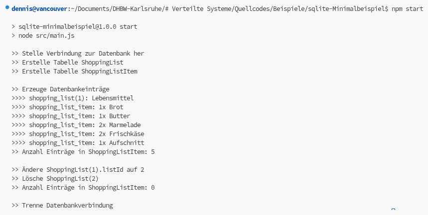

SQLite-Minimalbeispiel
======================

1. [Kurzbeschreibung](#kurzbeschreibung)
2. [Hinweis zur referentiellen Integrität](#hinweis-zur-referentiellen-integrität)
3. [Dokumentationen und Cheat Sheets](#dokumentationen-und-cheat-sheets)



Kurzbeschreibung
----------------

Jeder Microservice einer verteilten Anwendung (sofern diese Microservices nutzt), besitzt
typischerweise seine eigene Datenbank, die zusammen mit dem Microservice deployed wird.
Dadurch werden ungewollte Abhängigkeiten zwischen den Microservices vermieden, wodurch
diese möglichst unabhängig voneinander entwickelt und betrieben werden können. Jedoch ist
es für ein Vorlesungsbeispiel ein wenig Aufwändig, gleich ein richtiges Datenbank-Management-System
aufsetzen zu müssen. Mit Docker ginge das zwar vergleichsweise einfach. Aber gerade unter
Windows ist auch Docker nicht einfach zu installieren.

Oft kommt während der Entwicklung daher eine einfachere Lösung zum Einsatz: SQLite.
Dabei handelt es sich um eine eingebettete SQL-Datenbank, die nicht als externer Server,
sondern "eingebettet" in das sie nutzende Programm läuft. Dadurch hat man während der
Entwicklung eine einigermaßen leistungsstarke SQL-Datenbank zur Verfügung, ohne diese
separat aufsetzen zu müssen. Der Nachteil ist jedoch, dass SQLite alle Daten in einer
einzigen Daten ablegt und konkurrierende, nebenläufige Zugriffe, wie sie typisch für
verteilte Anwendungen sind, nicht gut unterstützt. Kein Problem während der Entwicklung.
Jedoch eignet sich SQLite daher in aller Regel nicht für die Produktivnutzung.

Dieses Beispiel zeigt, wie SQLite in Node.js mit dem [better-sqlite3](https://www.npmjs.com/package/better-sqlite3)-Paket
genutzt werden kann.

Hinweis zur referentiellen Integrität
-------------------------------------

SQLite unterstützt Fremdschlüssel mit den entsprechenden Prüfungen, die sicherstellen,
dass ein Tabelleneintrag beispielsweise nur gelöscht werden kann, wenn es keine anderen
Einträge mehr gibt, die auf ihn verweisen. Jedoch ist diese Prüfung standardmäßig ausgeschaltet!
Sie muss daher am Anfang des Programms mit folgendem Befehl, der an die Datenbank geschickt
wird, aktiviert werden:

```sql
PRAGMA foreign_keys = ON
```

Hier ein kleines Beispiel. Mit dem SQlite CLI kann es direkt auf der Konsole ausprobiert werden.

```sh
# SQlite auf der Konsole starten
sqlite3 testdb.sqlite
```

```sql
----------------------------------------------
-- SQL-Befehle zur Ausführung im SQLite CLI --
----------------------------------------------

-- Fremdschlüsselprüfung aktivieren
PRAGMA foreign_keys = ON;

-- Tabellen anlegen, wenn sie noch nicht existieren
CREATE TABLE IF NOT EXISTS ShoppingList(
  listId    INTEGER PRIMARY KEY, 
  listName  TEXT UNIQUE,
  createdAt TEXT DEFAULT CURRENT_TIMESTAMP
);

CREATE TABLE IF NOT EXISTS ShoppingListItem(
  itemId     INTEGER PRIMARY KEY AUTOINCREMENT,
  itemName   TEXT, 
  count      NUMBER CHECK (count > 0),

  -- Fremdschlüsselbeziehung herstellen
  listId     INTEGER REFERENCES ShoppingList(listId)
             ON UPDATE CASCADE
             ON DELETE CASCADE
);

-- Transaktion, um Daten einfügen
BEGIN TRANSACTION;
INSERT INTO ShoppingList (listId, listName) VALUES (1, 'Lebensmittel');
INSERT INTO ShoppingListItem (listId, itemName, count)
    VALUES (1, 'Brot',       1),
           (1, 'Butter',     1),
           (1, 'Marmelade',  2),
           (1, 'Frischkäse', 2),
           (1, 'Aufschnitt', 1);
COMMIT;

SELECT COUNT(*) FROM ShoppingListItem;

-- ID der Liste ändern: Ändert die Listen-ID ihrer Einträge
UPDATE ShoppingList SET listId = 2 WHERE listId = 1;
SELECT * FROM ShoppingListItem;

-- Löschen der Liste: Löscht auch ihre Einträge
DELETE FROM ShoppingList WHERE listId = 2;
SELECT COUNT(*) FROM ShoppingListItem;

-- SQLite CLI beenden
.quit
```

Dokumentationen und Cheat Sheets
--------------------------------

1. [SQLite-Referenzdokumentation](https://www.sqlite.org/docs.html)
1. [SQLite Cheat Sheet](https://www.dbpro.app/learn/sqlite/cheat-sheet)
1. [Datentypen in SQLite](https://www.sqlite.org/datatype3.html)
1. [better-sqlite3 API-Dokumentation](https://github.com/WiseLibs/better-sqlite3/blob/HEAD/docs/api.md)